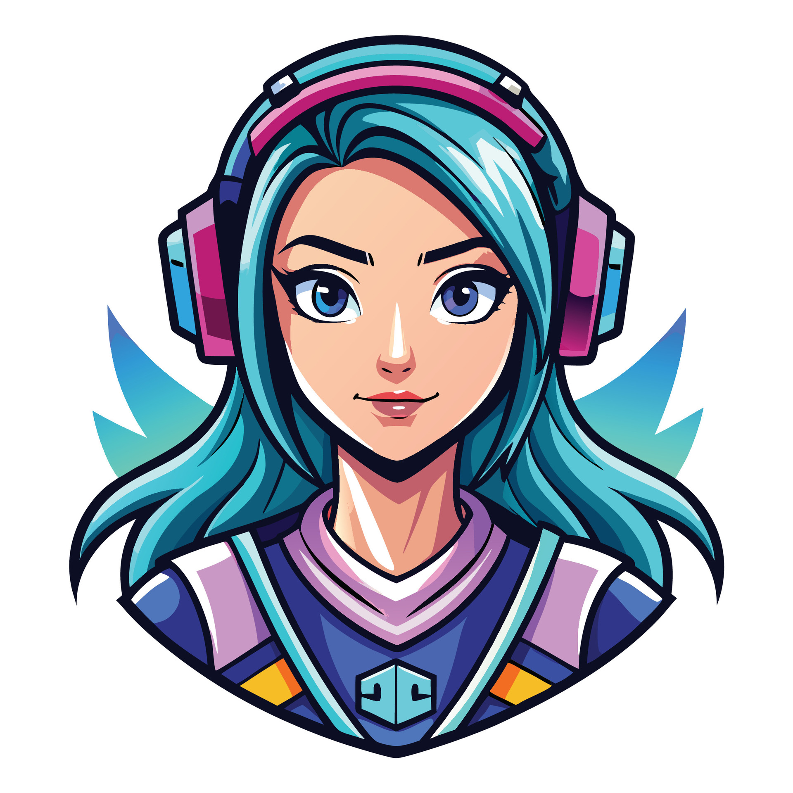

# Mayuri Khadse - MERN Stack Developer Portfolio

<div align="center">
  
</div>

<p align="center">
  Welcome to the official repository for my personal portfolio. This project was built from scratch using React and Vite to showcase my skills, projects, and experience as a Full-Stack Developer.
</p>

<p align="center">
  <a href="https://mayuri-s-portfolio.vercel.app/" target="_blank">
    <strong>🚀 View Live Demo 🚀</strong>
  </a>
</p>

---

### ✨ Features

This portfolio is more than just a static page; it's a demonstration of modern web development techniques.

-   🎨 **Dual-Theme Mode:** Switch between a sleek dark mode and a vibrant light mode.
-   🚀 **Elegant Animations:** Smooth, interactive animations on scroll and hover for an engaging user experience.
-   📱 **Fully Responsive:** A mobile-first design that looks great on all devices, from desktops to smartphones.
-   💼 **Dynamic Content:** All project, skill, and experience data is structured for easy updates.
-   💡 **Interactive Background:** A soothing, elegant particle network that subtly reacts to user interaction.

---

### 🛠️ Tech Stack

This project was built using a modern and powerful set of technologies:

<div align="center">
  
  
  
  
  
</div>

---

### ⚙️ Getting Started

To run this project locally on your machine, follow these simple steps.

1.  **Clone the repository:**
    ```bash
    git clone [https://github.com/mayuri-netizen/Mayuri-s_Portfolio.git](https://github.com/mayuri-netizen/Mayuri-s_Portfolio.git)
    ```

2.  **Navigate to the project directory:**
    ```bash
    cd Mayuri-s_Portfolio
    ```

3.  **Install dependencies:**
    ```bash
    npm install
    ```

4.  **Run the development server:**
    ```bash
    npm run dev
    ```
    The application will be available at `http://localhost:5173` (or the next available port).

---

### 🤝 Connect with Me

I'm always open to connecting and discussing new opportunities.

-   **LinkedIn:** [linkedin.com/in/mayuri-khadse-a87395218](https://www.linkedin.com/in/mayuri-khadse-a87395218/)
-   **Email:** khadsemayuri9@gmail.com

<br>

<div align="center">
  Thank you for visiting!
</div>
